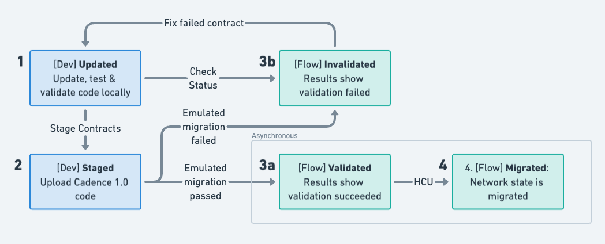

# Onchain Contract Update Mechanisms


[](https://codecov.io/gh/onflow/contract-updater)

This repo contains contracts enabling onchain staging of contract updates, providing mechanisms to store code,
delegate update capabilities, and execute staged updates.

## Context

Cadence 1.0 is a momentous milestone, introducing many advanced features to the language of Flow, the introduction of
which will require changes to all contracts on the network. This makes crossing that milestone a coordinated effort,
read on for how to prepare.

Your contract's path to Cadence 1.0 can be broken down into the following four high-level phases:

1. **Updated:** Update your code, validating refactored contracts, transactions and scripts via local testing and
   emulated migration.
2. **Staged:** Upload your Cadence 1.0 code to the `MigrationContractStaging` contract so your contract updates take
   effect at the network-wide height coordinated upgrade (HCU). 
3. **Validated:** This step is automated and serves as external feedback provided by Flow that your contract is good
   as-is, indicating readiness for the network migration. If your contract fails validation, you will need to update
   your code and stage it again.
4. **Migrated:** all core and staged contracts are updated via state migration


 
Steps 1 & 2 require your effort and execution - you must update your contract and execute a transaction to stage it for
migration. Step 3 is an asynchronous feedback loop between Flow and contract owners where staged contracts are migrated
in an emulated environment offchain, the results of which will be submitted to the staging contract on a set interval
(TBD). Step 4 will be completed by the network, executed as an HCU.

This process will need to be completed for all contracts on all networks, with a number of opportunities to collectively
practice on Crescendo Migration Testnet (CMT) before the HCU on Testnet and Mainnet.

> :mag: This repo addresses steps 2 & 3 above, providing a central coordination point for contract updates to be staged,
> code and staging status to be retrieved, and offchain validation results to be committed, queried and broadcast. Focus
> on reaching validated status across all of your contracts before the HCU, giving you confidence your contract updates
> will be successful.

## Overview

> :information_source: This document proceeds with an emphasis on the `MigrationContractStaging` contract, which will be
> used for the upcoming Cadence 1.0 network migration. Any contracts currently deployed on Testnet & Mainnet **WILL**
> need to be updated via state migration on the Cadence 1.0 milestone. This means you **MUST** stage your contract
> updates before the milestone for your contract to continue functioning. Keep reading to understand how to stage your
> contract update.

The `MigrationContractStaging` contract provides a mechanism for staging contract updates onchain in preparation for
Cadence 1.0. Once you have refactored your existing contracts to be Cadence 1.0 compatible, you will need to stage your
code in this contract for network state migrations to take effect and your contract to be updated with the Height
Coordinated Upgrade.

### `MigrationContractStaging` Deployments

> :information_source: The `MigrationContractStaging` contract is not yet deployed. Its deployment address will be added
> here once it has been deployed.

| Network   | Address                                                                                                                   |
| --------- | ------------------------------------------------------------------------------------------------------------------------- |
| Crescendo | [0x27b2302520211b67](https://crescendo.flowdiver.io/contract/A.27b2302520211b67.MigrationContractStaging?tab=deployments) |
| Testnet   | [0x2ceae959ed1a7e7a](https://contractbrowser.com/A.2ceae959ed1a7e7a.MigrationContractStaging)                             |
| Mainnet   | TBD                                                                                                                       |

### Pre-Requisites

- An existing contract deployed to your target network. For example, if you're staging `A` in address `0x01`, you should
  already have a contract named `A` deployed to `0x01`.
- A Cadence 1.0 compatible contract serving as an update to your existing contract. Extending our example, if you're
  staging `A` in address `0x01`, you should have a contract named `A` that is Cadence 1.0 compatible. See the references
  below for more information on Cadence 1.0 language changes.

### Staging Your Contract Update

Armed with your pre-requisites, you're ready to stage your contract update. Simply run the [`stage_contract.cdc`
transaction](./transactions/migration-contract-staging/stage_contract.cdc), passing your contract's name and Cadence
code as arguments and signing as the contract host account.

You can stage your contract using the [Flow Interaction Templates
(FLIX)](https://developers.flow.com/tools/flow-cli/flix) and the following command to execute the staging transaction
from [its interaction template](./flix/stage_contract.cdc.flix.json):

> :warning: Be sure to execute this transaction passing your contract's updated Cadence 1.0-compatible code

```sh
flow flix execute https://raw.githubusercontent.com/onflow/contract-updater/main/flix/stage_contract.cdc.flix.json \
    <CONTRACT_NAME> "$(cat <CONTRACT_FILEPATH>)" \
    --signer <YOUR_SIGNER_ALIAS> \
    --network <TARGET_NETWORK>
```

To execute the transaction from this project's local transaction code, run:

```sh
flow transactions send ./transactions/migration-contract-staging/stage_contract.cdc \
    <CONTRACT_NAME> "$(cat <CONTRACT_FILEPATH>)" \
    --signer <YOUR_SIGNER_ALIAS> \
    --network <TARGET_NETWORK>
```

Either of the above will execute the following transaction:

```cadence
import "MigrationContractStaging"

transaction(contractName: String, contractCode: String) {
    let host: &MigrationContractStaging.Host
    
    prepare(signer: AuthAccount) {
        // Configure Host resource if needed
        if signer.borrow<&MigrationContractStaging.Host>(from: MigrationContractStaging.HostStoragePath) == nil {
            signer.save(<-MigrationContractStaging.createHost(), to: MigrationContractStaging.HostStoragePath)
        }
        // Assign Host reference
        self.host = signer.borrow<&MigrationContractStaging.Host>(from: MigrationContractStaging.HostStoragePath)!
    }

    execute {
        // Call staging contract, storing the contract code that will update during Cadence 1.0 migration
        // If code is already staged for the given contract, it will be overwritten.
        MigrationContractStaging.stageContract(host: self.host, name: contractName, code: contractCode)
    }

    post {
        MigrationContractStaging.isStaged(address: self.host.address(), name: contractName):
            "Problem while staging update"
    }
}
```

At the end of this transaction, your contract will be staged in the `MigrationContractStaging` account. If you staged
this contract's code previously, it will be overwritten by the code you provided in this transaction.

> :warning: NOTE: Staging your contract successfully does not mean that your contract code is correct. Your testing and
> validation processes should include testing your contract code against the Cadence 1.0 interpreter to ensure your
> contract will function as expected.

### Checking Staging Status

You may later want to retrieve your contract's staged code. To do so, you can run the [`get_staged_contract_code.cdc`
script](./scripts/migration-contract-staging/get_staged_contract_code.cdc), passing the address & name of the contract
you're requesting and getting the Cadence code in return. This script can also help you get the staged code for your
dependencies if the project owner has staged their code.

You can run this script from [its template](./flix/get_staged_contract_code.cdc.flix.json) using
[FLIX](https://developers.flow.com/tools/flow-cli/flix) without the need to pull dependencies into your local project
with the Flow CLI command below.

```sh
flow flix execute https://raw.githubusercontent.com/onflow/contract-updater/main/flix/get_staged_contract_code.cdc.flix.json \
    <CONTRACT_ADDRESS> <CONTRACT_NAME> \
    --network <TARGET_NETWORK>
```

Alternatively, you can run the script from this project's local Cadence code with:

```sh
flow scripts execute ./scripts/migration-contract-staging/get_staged_contract_code.cdc \
    <CONTRACT_ADDRESS> <CONTRACT_NAME> \
    --network <TARGET_NETWORK>
```

Either of the above runs the script:

```cadence
import "MigrationContractStaging"

/// Returns the code as it is staged or nil if it not currently staged.
///
access(all) fun main(contractAddress: Address, contractName: String): String? {
    return MigrationContractStaging.getStagedContractCode(address: contractAddress, name: contractName)
}
```

## `MigrationContractStaging` Contract Details

### Developer Paths

The basic interface to stage a contract is the same as deploying a contract - name + code. See the
[`stage_contract`](./transactions/migration-contract-staging/stage_contract.cdc) &
[`unstage_contract`](./transactions/migration-contract-staging/unstage_contract.cdc) transactions. Note that calling
`stageContract()` again for the same contract will overwrite any existing staged code for that contract.

```cadence
/// 1 - Create a host and save it in your contract-hosting account at MigrationContractStaging.HostStoragePath
access(all) fun createHost(): @Host
/// 2 - Call stageContract() with the host reference and contract name and contract code you wish to stage.
/// NOTE: making updates to staged code resets validation status for that contract.
access(all) fun stageContract(host: &Host, name: String, code: String)
/// Removes the staged contract code from the staging environment.
access(all) fun unstageContract(host: &Host, name: String)
```

To stage a contract, the developer first saves a `Host` resource in their account which they pass as a reference along
with the contract name and code they wish to stage. The `Host` reference simply serves as proof of authority that the
caller has access to the contract-hosting account, which in the simplest case would be the signer of the staging
transaction, though conceivably this could be delegated to some other account via Capability - possibly helpful for some
multisig contract hosts.

```cadence
/// Serves as identification for a caller's address.
access(all) resource Host {
    /// Returns the resource owner's address
    access(all) view fun address(): Address
}
```

Within the `MigrationContractStaging` contract account, code is saved on a contract-basis as a `ContractUpdate` struct
within a `Capsule` resource and stored at a the derived path. The `Capsule` simply serves as a dedicated repository for
staged contract code. (See [Validation Path](#validation-path) for more on how `isValidated()` is determined.)

```cadence
/// Represents contract and its corresponding code.
access(all) struct ContractUpdate {
    /// Address of the contract host
    access(all) let address: Address
    /// Name of the contract
    access(all) let name: String
    /// The updated Cadence 1.0 code
    access(all) var code: String
    /// Timestamp the code was last updated
    access(all) var lastUpdated: UFix64

    /// Validates that the named contract exists at the target address.
    access(all) view fun exists(): Bool 
    /// Serializes the address and name into a string of the form 0xADDRESS.NAME
    access(all) view fun toString(): String
    /// Serializes contact into its string identifier of the form A.ADDRESS.NAME where ADDRESS is lacks 0x
    access(all) view fun identifier(): String
    /// Returns whether this contract update passed the last emulated migration, validating the contained code.
    /// NOTE: false could mean validation hasn't begun, the code wasn't included in emulation, or validation failed
    access(all) view fun isValidated(): Bool {
    /// Replaces the ContractUpdate code with that provided.
    access(contract) fun replaceCode(_ code: String)
}

/// Resource that stores pending contract updates in a ContractUpdate struct.
access(all) resource Capsule {
    /// The address, name and code of the contract that will be updated.
    access(self) let update: ContractUpdate

    /// Returns the staged contract update in the form of a ContractUpdate struct.
    access(all) view fun getContractUpdate(): ContractUpdate
    /// Replaces the staged contract code with the given Cadence code.
    access(contract) fun replaceCode(code: String)
}
```

To support monitoring staging progress across the network, the single `StagingStatusUpdated` event is emitted any time a
contract is staged (`status == "stage"`), staged code is replaced (`status == "replace"`), or a contract is unstaged
(`status == "unstage"`).

```cadence
access(all) event StagingStatusUpdated(
    capsuleUUID: UInt64,
    address: Address,
    code: String,
    contract: String,
    action: String
)
```

Included in the contact are methods for querying staging status and retrieval of staged code. This enables platforms to
display the staging status of contracts on any given account should.

```cadence
/* --- Public Getters --- */
//
/// Returns true if the contract is currently staged.
access(all) view fun isStaged(address: Address, name: String): Bool
/// Returns true if the contract is currently validated and nil if it's not staged.
access(all) view fun isValidated(address: Address, name: String): Bool?
/// Returns the names of all staged contracts for the given address.
access(all) view fun getStagedContractNames(forAddress: Address): [String]
/// Returns the staged contract Cadence code for the given address and name.
access(all) view fun getStagedContractCode(address: Address, name: String): String?
/// Returns an array of all staged contract host addresses.
access(all) view fun getAllStagedContractHosts(): [Address]
/// Returns the ContractUpdate struct for the given contract if it's been staged.
access(all) view fun getStagedContractUpdate(address: Address, name: String): ContractUpdate?
/// Returns a dictionary of all staged contract code for the given address.
access(all) view fun getAllStagedContractCode(forAddress: Address): {String: String}
/// Returns all staged contracts as a mapping of address to an array of contract names
access(all) view fun getAllStagedContracts(): {Address: [String]}
```

### Validation Path

In addition to monitoring the number of staged contracts, it will also be important to monitor staged contracts that
fail validation.

The `EmulatedMigrationResult` event will be emitted whenever the `Admin` commits the result of offchain emulated migration.

```cadence
/// Emitted when emulated contract migrations have been completed, where failedContracts are named by their
/// contract identifier - A.ADDRESS.NAME where ADDRESS is the host address without 0x
access(all) event EmulatedMigrationResultCommitted(
    snapshotTimestamp: UFix64,
    committedTimestamp: UFix64,
    failedContracts: [String]
)
```

Emulated migration results will be saved as `MigrationContractStaging.lastEmulatedMigrationResult: EmulatedMigrationResult?`,
the value of which will be `nil` until offchain emulation begins. `ContractUpdate.isValidated()` will check against
this value to determine if the staged contract code has been validated.

```cadence 
access(all) struct EmulatedMigrationResult {
    /// Timestamp that the migration snapshot was taken
    access(all) let snapshot: UFix64
    /// Timestamp that the migration results were committed
    access(all) let committed: UFix64
    /// Identifiers of the contracts that failed validation during the emulated migration
    access(all) let failedContracts: [String]
}
```

Finally, the the entities empowered with coordinating both contract validation and the HCU can perform admin
functionalities via the `Admin` resource.

```cadence
access(all) resource Admin {
    /// Sets the block height at which updates can no longer be staged
    access(all) fun setStagingCutoff(at height: UInt64?)
    /// Commits the results of an emulated contract migration
    access(all) fun commitMigrationResults(snapshot: UFix64, failed: [String])
}
```

## References

> Please feel free to submit a PR with updated references as they become available!

More tooling is slated to support Cadence 1.0 code changes and will be added as it arises. For any real-time help, be
sure to join the [Flow discord](https://discord.com/invite/J6fFnh2xx6) (especially the developer channels) and the [Flow
forum](https://forum.flow.com/).

- [Cadence 1.0 contract migration plan](https://forum.flow.com/t/update-on-cadence-1-0-upgrade-plan/5597)
- [Cadence 1.0 language update breakdown](https://forum.flow.com/t/update-on-cadence-1-0/5197)
- [Cadence Language reference](https://cadence-lang.org/)
- [Emerald City's Cadence 1.0 by Example](https://academy.ecdao.org/en/cadence-by-example)
